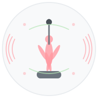
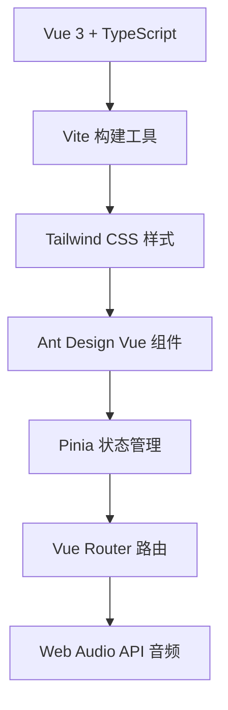

# 🧘‍♀️ BeatFlow - 瑜伽节拍器

<div align="center">



**专为瑜伽练习设计的智能节拍器应用**

[](https://vuejs.org/)
[](https://www.typescriptlang.org/)
[](https://vitejs.dev/)
[](https://tailwindcss.com/)

[](https://opensource.org/licenses/MIT)
[](https://nodejs.org/)
[](https://www.npmjs.com/)

</div>

## ✨ 特色功能

- 🎵 **精准节拍控制** - 支持30-200 BPM范围，满足不同瑜伽练习需求
- 🎼 **多种拍号支持** - 2/4、3/4、4/4拍号，适配各种瑜伽流派
- 🔊 **丰富音效选择** - 多种节拍音效，营造专业练习氛围
- ⏱️ **智能计时器** - 精确计时功能，帮助掌控练习时长
- 📱 **响应式设计** - 完美适配手机、平板、电脑等设备
- 🎨 **优雅界面** - 简洁美观的用户界面，专注练习体验

## 🚀 快速开始

### 📋 环境要求

-  **Node.js** >= 22.0.0
-  **npm** >= 10.0.0

### 🛠️ 安装依赖

```bash
npm install
```

### 🏃‍♂️ 开发模式

```bash
npm run dev
```

访问 [http://localhost:5173](http://localhost:5173) 开始使用

### 📦 生产构建

```bash
npm run build
```

### 🔍 代码检查

```bash
npm run lint
```

## 🎯 使用指南

### 基础操作

1. **设置BPM** - 使用滑块调整节拍速度（30-200 BPM）
2. **选择拍号** - 根据练习需要选择合适的拍号
3. **音效设置** - 选择喜欢的节拍音效
4. **开始练习** - 点击播放按钮开始瑜伽练习

### 瑜伽练习建议

| 练习类型 | 推荐BPM | 拍号 | 说明 |
|---------|---------|------|------|
| 🧘 冥想练习 | 60-80 | 4/4 | 缓慢深呼吸，放松身心 |
| 🌊 流瑜伽 | 80-120 | 4/4 | 流畅连贯的体式转换 |
| 💪 力量瑜伽 | 100-140 | 4/4 | 增强肌肉力量和耐力 |
| 🌅 晨练瑜伽 | 70-100 | 3/4 | 温和唤醒身体活力 |

## 🏗️ 技术架构

<div align="center">



</div>

### 🔧 核心技术栈

- **前端框架**: Vue 3 + Composition API
- **开发语言**: TypeScript
- **构建工具**: Vite
- **样式方案**: Tailwind CSS
- **UI组件**: Ant Design Vue (按需导入)
- **状态管理**: Pinia
- **路由管理**: Vue Router
- **音频处理**: Web Audio API

### 📊 性能优化

- ✅ **按需导入** - Ant Design Vue组件按需加载，减少90%+ bundle大小
- ✅ **代码分割** - 智能代码分割，提升加载速度
- ✅ **资源优化** - SVG图标，减少资源体积
- ✅ **现代构建** - 基于Vite的快速构建和热更新

## 📁 项目结构

```
BeatFlow/
├── 📁 public/                 # 静态资源
│   └── favicon.svg           # 网站图标
├── 📁 src/
│   ├── 📁 assets/            # 资源文件
│   │   ├── logo.svg          # 应用Logo
│   │   └── *.css             # 样式文件
│   ├── 📁 components/        # 组件目录
│   │   ├── BpmController.vue      # BPM控制器
│   │   ├── MetronomeController.vue # 节拍器控制
│   │   ├── SoundOptions.vue       # 音效选择
│   │   ├── TimeSignatureSelector.vue # 拍号选择
│   │   └── TimerDisplay.vue       # 计时显示
│   ├── 📁 views/             # 页面组件
│   │   ├── HomeView.vue      # 主页
│   │   └── AboutView.vue     # 关于页面
│   ├── 📁 stores/            # 状态管理
│   ├── 📁 types/             # 类型定义
│   └── 📁 router/            # 路由配置
├── 📄 package.json           # 项目配置
├── 📄 vite.config.ts         # Vite配置
├── 📄 tailwind.config.js     # Tailwind配置
└── 📄 tsconfig.json          # TypeScript配置
```

## 🤝 贡献指南

我们欢迎所有形式的贡献！

1. 🍴 Fork 本仓库
2. 🌿 创建特性分支 (`git checkout -b feature/AmazingFeature`)
3. 💾 提交更改 (`git commit -m 'Add some AmazingFeature'`)
4. 📤 推送到分支 (`git push origin feature/AmazingFeature`)
5. 🔀 创建 Pull Request

## 📝 开发计划

- [ ] 🎵 更多音效选择
- [ ] 📱 PWA支持，离线使用
- [ ] 🌍 国际化支持
- [ ] 📊 练习数据统计
- [ ] 🎨 主题切换功能
- [ ] 🔔 练习提醒功能

## 📄 许可证

本项目基于 [MIT License](LICENSE) 开源协议。

## 🙏 致谢

感谢以下开源项目的支持：

- [Vue.js](https://vuejs.org/) - 渐进式JavaScript框架
- [Vite](https://vitejs.dev/) - 下一代前端构建工具
- [Tailwind CSS](https://tailwindcss.com/) - 实用优先的CSS框架
- [Ant Design Vue](https://antdv.com/) - 企业级UI组件库

---

<div align="center">

**用心打造，专注瑜伽练习体验** 🧘‍♀️✨

[🌟 给个Star](https://github.com/spcookie/BeatFlow) | [🐛 报告问题](https://github.com/spcookie/BeatFlow/issues) | [💡 功能建议](https://github.com/spcookie/BeatFlow/issues)

</div>
